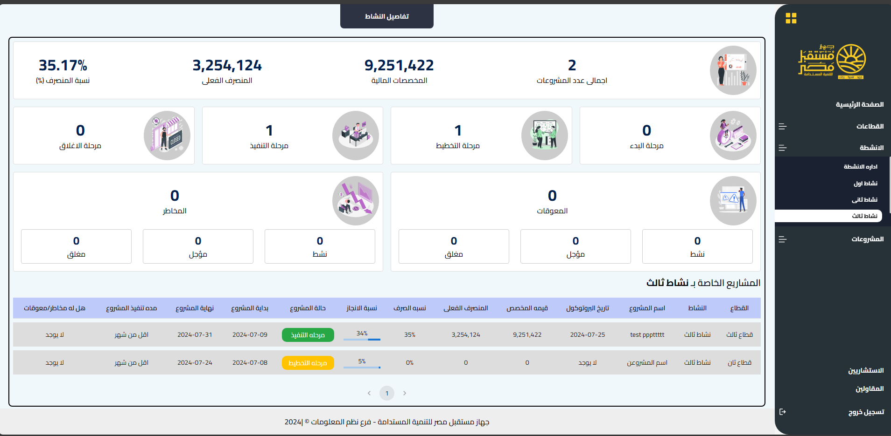

# Project Management App

This is a React-based application for managing projects. The application offers various functionalities to track, manage, and analyze projects, sectors, activities, consultants, and contractors.

## Table of Contents

- [Features](#features)
- [Dependencies](#dependencies)
- [Installation](#installation)
- [Usage](#usage)

- [Screenshots](#screenshots)
- [Contributing](#contributing)

## Features

### Home Page

- **Statistics Overview**:
  - Total Projects
  - Budget
  - Spent Budget
  - Total Percentage
  - Total Completed Projects
  - Total In Progress Projects
  - Total On Hold Projects
  - Total Not Started Projects
  - Total Handicaps
  - Total Active Handicaps
  - Total Closed Handicaps
  - Total On Hold Handicaps
  - Total Risks
  - Total Active Risks
  - Total Closed Risks
  - Total On Hold Risks

### Sectors Menu

- **Manage Sector**:
  - CRUD operations on sectors
  - Display total projects for each sector
- **Sector Statistics**:
  - Show statistics and projects for a selected sector

### Activities Menu

- **Manage Activity**:
  - CRUD operations on activities
  - Display total projects for each activity
- **Activity Statistics**:
  - Show statistics and projects for a selected activity

### Projects Menu

- **Projects Box**:
  - Display all projects with search, filter, print, and navigation capabilities
  - Click on a project to view its details and can edit or print the project
- **Add/Edit/Delete Project**:
  - Add project details (name, description, activity, sector, status, percentage, start and end date, contractors, consultants, budget date, spent budget date, handicaps, risks)
  - edit project details and delete the project

### Project Details Page

- **Budget vs. Spent Budget Chart**
- **Project Details**

### Consultants Menu

- **Manage Consultants**:
  - CRUD operations on consultants
  - Display total projects for each consultant
  - Click on a consultant to view their information and related projects

### Contractors Menu

- **Manage Contractors**:
  - CRUD operations on contractors
  - Display total projects for each contractor
  - Click on a contractor to view their information and related projects

### Authentication

- **login/logout**: Secure user functionality
 
## Dependencies

- **@canvasjs/charts**: ^3.9.0
- **@canvasjs/react-charts**: ^1.0.2
- **@emotion/react**: ^11.11.4
- **@emotion/styled**: ^11.11.5
- **@mui/icons-material**: ^5.15.18
- **@mui/material**: ^5.15.18
- **@mui/x-date-pickers**: ^7.5.0
- **@reduxjs/toolkit**: ^2.2.5
- **axios**: ^1.7.0
- **chart.js**: ^4.4.3
- **chartjs-adapter-date-fns**: ^3.0.0
- **chartjs-plugin-datalabels**: ^2.2.0
- **date-fns**: ^3.6.0
- **dayjs**: ^1.11.11
- **formik**: ^2.4.6
- **html2canvas**: ^1.4.1
- **js-cookie**: ^3.0.5
- **jwt-decode**: ^4.0.0
- **react**: ^18.3.1
- **react-chartjs-2**: ^5.2.0
- **react-dom**: ^18.3.1
- **react-jwt**: ^1.2.1
- **react-lottie**: ^1.2.4
- **react-redux**: ^9.1.2
- **react-router-dom**: ^6.23.1
- **react-to-print**: ^2.15.1
- **react-toastify**: ^10.0.5
- **stylis**: ^4.3.2
- **stylis-plugin-rtl**: ^2.1.1
- **sweetalert2**: ^11.12.0
- **sweetalert2-react-content**: ^5.0.7
- **yup**: ^1.4.0

## Installation

To get started with the project , follow these steps:

1. Clone the repository:

   ```sh
   git clone https://github.com/mohamedsaeed22/mangement-contracts.git
   cd mangement-contracts
   ```

2. Install the dependencies:

   ```sh
   npm install
   ```

3. Start the development server:
   ```sh
   npm start
   ```

The application will be available at `http://localhost:3000`.

## Usage
To use the manage project app, follow the installation steps above. Once the development server is running, you can access the application in your web browser.

## Screenshots

Here are some screenshots of the project:

<details>
  <summary>Login Page</summary>
  
</details>

<details>
  <summary>Home Page</summary>
  
</details>

<details>
  <summary>Manage Sectors</summary>
  
</details>

<details>
  <summary>Sector</summary>
  
</details>

<details>
  <summary>Manage Activities</summary>
  
</details>

<details>
  <summary>Activity</summary>
  
</details>

<details>
  <summary>Project Box</summary>
  
</details>

<details>
  <summary>Add Project</summary>
  
</details>

<details>
  <summary>Project Details</summary>
  
</details>

<details>
  <summary>Edit/Delete Project</summary>
  
</details>

<details>
  <summary>Manage Consultant</summary>
  
</details>

<details>
  <summary>Consultant Details</summary>
  
</details>

<details>
  <summary>Manage Contractor</summary>
  
</details>

<details>
  <summary>Contractor Details</summary>
  
</details>

## Contributing

Contributions are welcome! Please fork the repository and create a pull request with your changes. Ensure that your code adheres to the project's coding standards and includes appropriate tests.

1. Fork the repository
2. Create a new branch (`git checkout -b feature-branch`)
3. Commit your changes (`git commit -am 'Add new feature'`)
4. Push to the branch (`git push origin feature-branch`)
5. Create a new pull request
